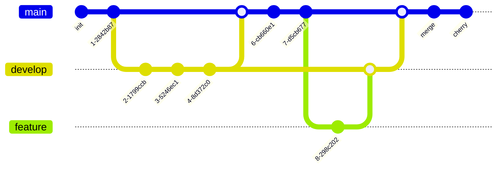

```mermaid
    gitGraph
       commit id: "init"
       commit
       branch develop
       commit
       commit
       commit
       checkout main
       merge develop
       commit
       commit
       branch feature
       commit
       checkout develop
       merge feature
       checkout main
       merge develop
       commit id: "merge"
       commit id: "cherry"
```
